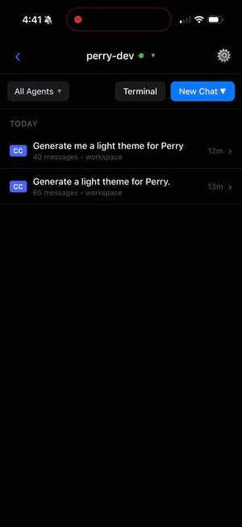
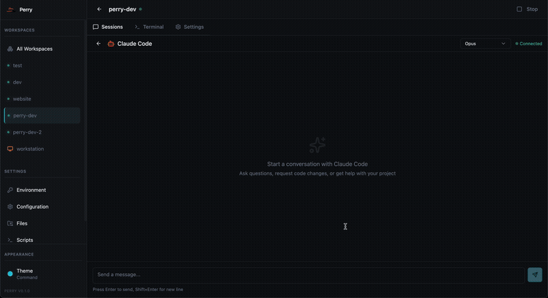

<p align="center">
  
</p>

<h1 align="center">Perry</h1>

<p align="center">
  <a href="https://gricha.github.io/perry/"></a>
  <a href="https://github.com/gricha/perry/actions/workflows/test.yml"></a>
  <a href="https://github.com/gricha/perry/releases"></a>
  <a href="https://opensource.org/licenses/MIT"></a>
</p>

<p align="center">
  Continue your coding sessions on the go. Self-hosted workspaces, accessible over Tailscale.
</p>

<p align="center">
  
  &nbsp;&nbsp;&nbsp;
  
</p>

## Overview

Perry is an agent (agent P) designed to run as a daemon on your machine. It allows your clients - other machines through CLI, web, or mobile app - to connect directly to your workspaces over the Tailscale network.

It can be connected directly to your host, or it can create docker containers so that your work can be fully isolated.

Continue your sessions on the go!

**[Get Started →](https://gricha.github.io/perry/docs/getting-started)**

## Features

- **AI Coding Agents** - Claude Code, OpenCode, Codex CLI pre-installed
- **Self-Hosted** - Run on your own hardware, full control
- **Remote Access** - Use from anywhere via Tailscale, CLI, web, or SSH
- **Web UI** - Manage workspaces from your browser
- **Isolated Environments** - Each workspace runs in its own container

## Setup

### Install

```bash
curl -fsSL https://raw.githubusercontent.com/gricha/perry/main/install.sh | bash
```

### Start Agent

```bash
perry agent run
```

Web UI: **http://localhost:7391** (or your Tailscale host)

### Create & Use Workspaces

**Via CLI:**

```bash
# Create workspace
perry create myproject

# Or clone a repo
perry create myproject --clone git@github.com:user/repo.git

# Shell into workspace
perry shell myproject

# Manage workspaces
perry start myproject
perry stop myproject
perry delete myproject
perry list
```

**Via Web UI:**

Open http://localhost:7391 (or your Tailscale host) and click "+" to create a workspace.

<p align="center">
  
</p>

## Security

Perry is designed for use within **secure private networks** like [Tailscale](https://tailscale.com). The web UI and API currently have no authentication - this is intentional for private network use where all devices are trusted.

NOTE: Using this software can be dangerous, don't expose it on the network. Any user that can access perry's web server may be able to do serious damage to your system. Keep it closed in Tailscale network.

Perry by default allows the API to interact with the host machine as well - while it's intended purpose is to manage docker containers, sometimes, for simplicity I run some of my jobs directly on my machine. This can be disabled. When you start perry, you can pass a `--no-host-access` flag.

`perry agent run --no-host-access`

This will ensure that perry can only stand up/tear down docker containers. While this reduces the attack surface, it is only as good as docker is as sandbox (and it may very well not be).

## Configuration

Configure credentials and agent settings via Web UI → Settings or edit `~/.config/perry/config.json`:

```json
{
  "credentials": {
    "env": {},
    "files": {
      "~/.ssh/id_ed25519": "~/.ssh/id_ed25519",
      "~/.gitconfig": "~/.gitconfig"
    }
  },
  "agents": {
    "github": {
      "token": "ghp_..."
    },
    "claude_code": {
      "oauth_token": "..."
    },
    "opencode": {
      "zen_token": "..."
    }
  }
}
```

Restart workspaces to apply changes.

## What's Inside Each Workspace

- Ubuntu 24.04 LTS
- Node.js 22, Python 3, Go
- Docker (for containerized development)
- Neovim + LazyVim
- Git, GitHub CLI, ripgrep, fd-find, jq
- Claude Code, OpenCode, Codex CLI

## Commands

```bash
# Agent
perry agent run [--port PORT]
perry agent status

# Workspaces
perry create <name> [--clone URL]
perry start <name>
perry stop <name>
perry delete <name>
perry list
perry shell <name>
perry logs <name>
```

## Development

```bash
git clone https://github.com/gricha/perry.git
cd perry
bun install
bun run build
```

Run tests:

```bash
bun run validate  # Lint, typecheck, build, test
bun run test      # Tests only
```

## License

MIT
